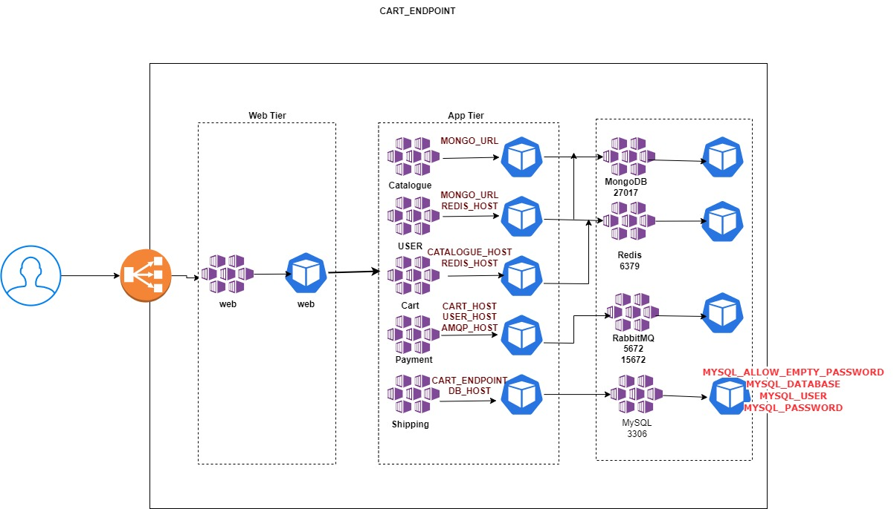

### Roboshop using Pod, ConfigMaps, Secrets

This project is configure RoboShop using Pods, ConfigMaps, Secrets. These are the basic building blocks of kuberntes.

#### Pre-requisites
* Watch the below diagram to understand the dependency.
* We are maintaining ConfigMap and Secret separately.
* Don't change the default ports of DB tier with the service attachment.
* Nginx config in web project is important.

# Project functionality:
# User access: 
* User accessing through LoadBalance URL and it comes to web services, and it sends the requests to the web pod. From here, every communication is through the service only.

* We've catalogue service, mongoDB service, there's also configmap dependencies. 
* All the required environmental variables will be supplied through this configmap. 

* We've default ports for MongoDB: 27017, Redis: 6379, RabbitMQ: 5672, 15672, MySQL: 3306

* We've App Tier, Database Tier, Web Tier
*  App Tier and Web Tier works on HTTP/HTTPS protocol. 
* Databases, there've their own protocols. MongoDB, Redis have their own protocols.  RabbitMQ has AMQP protocol, MySQL has MYSQL protocol. 

* For HTTP, we're configuring services on port:80. But for the Database services, we're not modifying the ports. Background they rely on their own ports to connect. 

# DB-tier
mongodb
redis
rabbitmq
mysql

# App-tier
user
shipping
cart
payment
catalogue
web

# Error:
OOMKILLED
it is an error when CPU & Memory resources are not provided sufficiently