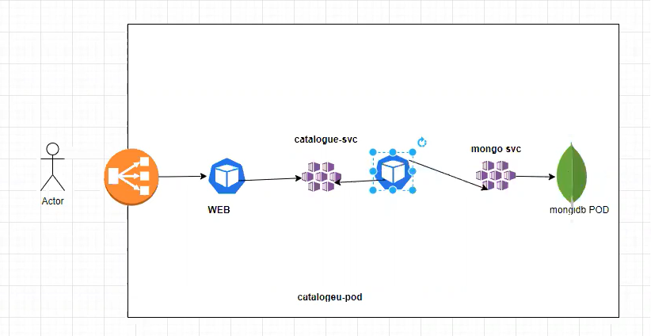

Communication is going from,

 user --> LoadBalancer --> web --> catalogue-service --> catalogue-pod --> mongo-service --> mongodb-pod

# After creating web.
login into web and call catalogue service

$ kubectl exec -it web -- bash
root@web:/# curl http://catalogue-service:8080

# Now, the communication is going from user to loadbalancer

